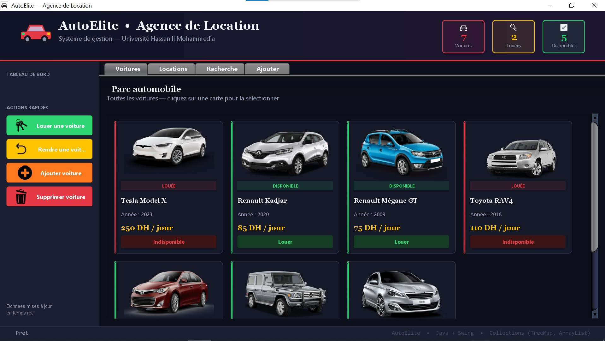
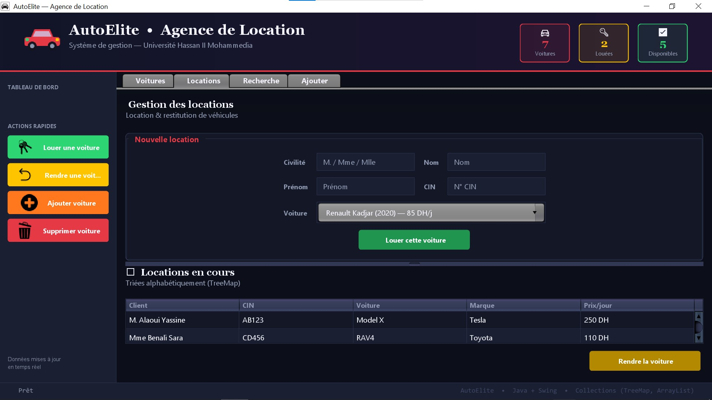
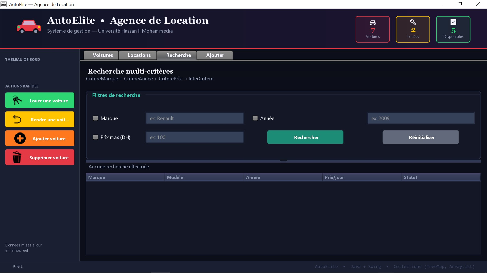
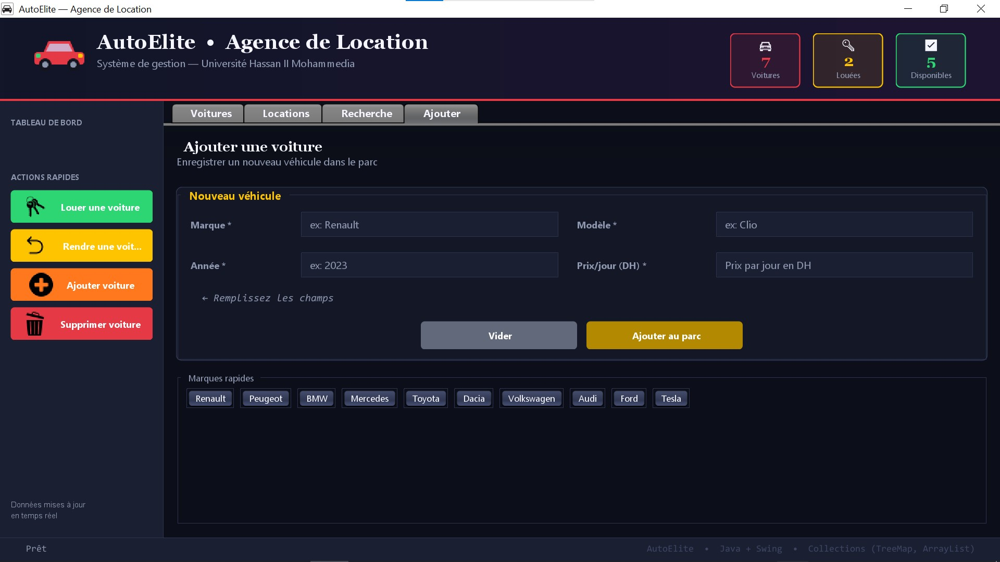

# 🚗 AutoElite — Agence de Location de Voitures

> Projet Java universitaire — Université Hassan II Mohammedia  
> Interface graphique Swing pour la gestion d'une agence de location de véhicules

---

## 📸 Aperçu

| Parc automobile | Gestion des locations |
|---|---|
|  |  |

| Recherche multi-critères | Ajouter une voiture |
|---|---|
|  |  |

---

## 📋 Description

**AutoElite** est une application de bureau développée en **Java + Swing** permettant de gérer le parc automobile d'une agence de location. Elle illustre l'utilisation des **collections Java** (`ArrayList`, `TreeMap`), du **patron de conception Critère**, ainsi que la **gestion des exceptions personnalisées**.

---

## ✨ Fonctionnalités

- 🚘 **Parc automobile** — visualisation de toutes les voitures sous forme de cartes avec statut (Disponible / Louée)
- 📋 **Gestion des locations** — louer une voiture à un client, restituer un véhicule, liste triée alphabétiquement via `TreeMap`
- 🔍 **Recherche multi-critères** — filtrer par marque, année et/ou prix maximum grâce au pattern `InterCritere`
- ➕ **Ajouter une voiture** — enregistrer un nouveau véhicule dans le parc
- 🗑️ **Supprimer une voiture** — retirer un véhicule de la flotte via une boîte de dialogue
- 📊 **Tableau de bord** — statistiques en temps réel (total voitures, louées, disponibles)

---

## 🏗️ Architecture du projet

```
EX/
├── Voiture.java                  # Entité voiture (marque, modèle, année, prix)
├── Client.java                   # Entité client avec Comparable (tri alphabétique)
├── Agence.java                   # Logique métier : gestion des voitures et locations
├── VoitureNonDisponibleException.java  # Exception personnalisée
│
├── Critere.java                  # Interface du pattern Critère
├── CritereMarque.java            # Filtre par marque
├── CritereAnnee.java             # Filtre par année
├── CriterePrix.java              # Filtre par prix maximum
├── InterCritere.java             # Intersection de plusieurs critères (AND logique)
│
└── AgenceGUI.java                # Interface graphique Swing (point d'entrée)
```

---

## 🧩 Concepts Java illustrés

| Concept | Classe(s) concernée(s) |
|---|---|
| Interface & polymorphisme | `Critere`, `CritereMarque`, `CritereAnnee`, `CriterePrix` |
| Pattern Composite (Critère) | `InterCritere` |
| Exception personnalisée | `VoitureNonDisponibleException` |
| `ArrayList` | Liste du parc de voitures dans `Agence` |
| `TreeMap` | Locations triées alphabétiquement par client |
| `Comparable<T>` | `Client` — comparaison par nom puis prénom |
| `Iterator<T>` | `selectionne()` et `lesVoituresLouees()` dans `Agence` |
| Java Swing | `AgenceGUI` — interface graphique complète |

---

## 🚀 Lancement

### Prérequis

- Java JDK 11 ou supérieur
- Un IDE Java (IntelliJ IDEA, Eclipse, NetBeans) ou compilation en ligne de commande

### Compilation & exécution

```bash
# Compiler tous les fichiers du package
javac -d out src/EX/*.java

# Lancer l'application
java -cp out EX.AgenceGUI
```

### Depuis un IDE

1. Importer le projet
2. S'assurer que les images sont dans `./src/img/`
3. Exécuter la classe `AgenceGUI`

### Structure des images attendue

```
src/
└── img/
    ├── pngimg.com-tesla_car_PNG48.png
    ├── pngimg.com-renault_PNG70.png
    ├── pngimg.com-renault_PNG44.png
    ├── pngimg.com-toyota_PNG1915.png
    ├── pngimg.com-toyota_PNG1919.png
    ├── pngimg.com-mercedes_PNG80166.png
    ├── pngimg.com-peugeot_PNG34662.png
    └── transport.png
```

> ⚠️ En l'absence des images, l'application fonctionne normalement mais les cartes n'afficheront pas les photos de véhicules.

---

## 🎨 Interface graphique

L'interface adopte un **thème sombre moderne** (dark UI) avec :

- Palette `#0C0F19` / `#141826` / `#1A1F32`
- Accents colorés : rouge `#E63946`, vert `#2ED573`, or `#FFC400`
- Typographie : Georgia (titres) + Segoe UI (corps)
- Cartes de voitures avec statut visuel
- Actions rapides dans la barre latérale

---

## 📚 Contexte académique

Ce projet a été réalisé dans le cadre d'un **TP de programmation orientée objet** à l'**Université Hassan II Mohammedia**, couvrant les thèmes suivants :

- Q1–Q3 : Création des classes `Voiture`, critères `CritereMarque` et `CriterePrix`
- Q4 : Méthode `selectionne()` avec `Iterator`
- Q6 : Intersection de critères avec `InterCritere`
- Q7 : Critère par année `CritereAnnee`
- Q8 : Gestion des locations avec exceptions (`loueVoiture`, `rendVoiture`)
- Q9 : Classe `Client` avec `equals()` / `hashCode()`
- Q10 : `TreeMap<Client, Voiture>` pour un tri alphabétique automatique
- Q11 : Interface graphique Swing (`AgenceGUI`)

---

## 👤 Auteur

Projet réalisé par un étudiant de la **Faculté des Sciences et Techniques de Mohammedia (FSTM)** — Université Hassan II.

---

## 📄 Licence

Ce projet est à usage **éducatif uniquement**.
